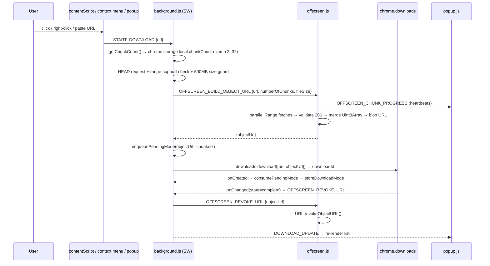

# ChunkFlow — Architecture

How the extension is wired, end to end. Pairs with the feature-level [README](../README.md).
Everything lives in `extension/` (the folder you load unpacked).

---

## 1. Components

| File | Runtime context | Responsibility |
|------|-----------------|----------------|
| `manifest.json` | — | Permissions, script wiring, version |
| `background.js` | MV3 **service worker** | Orchestrates downloads/uploads, mode attribution, Chrome Downloads API, message router |
| `offscreen.js` / `offscreen.html` | **Offscreen document** | Fetches byte-range chunks in parallel, merges them, creates the `blob:` URL |
| `contentScript.js` | **Page** (all http/https) | Detects download links, intercepts clicks, forwards to background |
| `popup.html` / `popup.css` / `popup.js` | **Popup** | UI: chunk-count control, download history + badges, upload testing |
| `utils.js` | shared (imported everywhere) | Pure helpers: `formatFileSize`, `validateUrl`, `clampChunkCount`, mode-queue helpers |

### Why an offscreen document?
`URL.createObjectURL` does **not** exist inside an MV3 service worker. Chunked downloads
must build a `blob:` URL from the merged bytes, so that work runs in an offscreen document
(`offscreen` permission, reason `BLOBS`). The service worker only orchestrates.

---

## 2. Download flow (chunked path)

**Fallback decisions** (each ends the chunked attempt early):
- HEAD/probe shows no range support → `normal` (native download).
- `Content-Length` > 500 MB (`CHUNK_MAX_BYTES`) → `normal` (avoids assembling GBs in memory).
- Offscreen assembly throws after all retries → `fallback` (native download of original URL).
- Chunk attempt fails → retried at fewer chunks (`[configured, 6, 4]`) before giving up.

---

## 3. Download-mode attribution

Every download item gets a badge. The mode is decided **before** Chrome creates the item and
stashed in storage so the popup's next render always has it.

| Mode | Badge | Meaning |
|------|-------|---------|
| `chunked` | ⚡ Chunked | Assembled from parallel chunks |
| `normal` | ⬇ Normal (CF) | ChunkFlow chose the native path (no range support / too large) |
| `fallback` | ⚠ Fallback | Chunking was attempted, failed, then native path used |
| `browser` | 🌐 Browser | Download started outside ChunkFlow (address bar, other extension) |

### Why a queue instead of a variable?
The service worker can unload between `downloads.download()` and the `onCreated` event.
An in-memory variable would be lost. Instead the intended mode is **enqueued in
`chrome.storage.local` keyed by URL** (`pendingModeByUrl`), then `onCreated` dequeues it and
writes the final `downloadModes[id]`. Helpers `enqueueModeForUrl` / `consumeModeForUrl` live in
`utils.js` and are unit-tested. If `onCreated` finds no pending mode, the download originated
outside ChunkFlow → tagged `browser`.

---

## 4. Storage keys (`chrome.storage.local`)

| Key | Written by | Shape | Purpose |
|-----|-----------|-------|---------|
| `chunkCount` | popup | `number` (2–32) | User's parallel-chunk setting |
| `pendingModeByUrl` | background | `{ [url]: mode[] }` | In-flight mode queue (survives SW suspension) |
| `downloadModes` | background | `{ [downloadId]: mode }` | Final badge per download |
| `downloadModeMeta` | background | `{ [downloadId]: {source, reason, sourceUrl} }` | Badge tooltip/explanation |
| `activeChunkFetches` | background | `[{url, requestId, stage, ...}]` | "Preparing" placeholders shown before Chrome creates the item |
| `uploadedFiles` | background | `[{name, size, type, timestamp}]` | Upload history |

---

## 5. Message types

Sent via `chrome.runtime.sendMessage` (one-shot) except the popup↔background live link,
which is a long-lived `chrome.runtime.connect()` **port** (`popupPort`) used to push
`DOWNLOAD_UPDATE` / `DOWNLOAD_READY` / `ERROR`.

| Type | Direction | Purpose |
|------|-----------|---------|
| `START_DOWNLOAD` | content/popup → bg | Begin a ChunkFlow download |
| `UPLOAD_FILE` | popup → bg | Begin a (possibly chunked) upload |
| `GET_UPLOADED_FILES` | popup → bg | Read upload history |
| `PAUSE/RESUME/RESTART/DELETE_DOWNLOAD` | popup → bg | Download controls |
| `OFFSCREEN_BUILD_OBJECT_URL` | bg → offscreen | Fetch + merge chunks, return blob URL |
| `OFFSCREEN_CHUNK_PROGRESS` | offscreen → bg/popup | Progress heartbeats |
| `OFFSCREEN_CANCEL_REQUEST` | bg → offscreen | Abort in-flight chunk fetches |
| `OFFSCREEN_REVOKE_URL` | bg → offscreen | Free a blob URL after the download finishes |
| `DOWNLOAD_UPDATE` / `DOWNLOAD_READY` / `ERROR` | bg → popup (port) | UI refresh signals |

**Sender validation:** background rejects untrusted senders (`isTrustedSender`), and offscreen
only accepts messages whose `sender.url` is `background.js`.

---

## 6. MV3 constraints that shaped the design

- **Service worker unloads when idle** → no long-lived in-memory state; mode queue + settings
  live in `chrome.storage.local`.
- **No `URL.createObjectURL` in the worker** → offscreen document for blob assembly.
- **In-memory merge** → 500 MB guard (`CHUNK_MAX_BYTES`) diverts large files to the native
  downloader to avoid OOM.
- **Blobs must be revoked in their creating context** → background messages offscreen to revoke.

---

## 7. Testing

| Command | What it covers |
|---------|----------------|
| `npm test` | Jest unit tests for `utils.js` (formatting, validation, `clampChunkCount`, mode-queue helpers) |
| `npm run test:e2e` | Playwright: loads the unpacked extension in real Chrome, triggers a download, asserts the resulting mode. Hits real external URLs — override with `CHUNKFLOW_TEST_URL_CHUNKED` / `CHUNKFLOW_TEST_URL_LARGE`. |

There is **no build step and no linter** — the extension is loaded unpacked as-is.
Syntax-check edited files with `node --check <file>` before loading.
